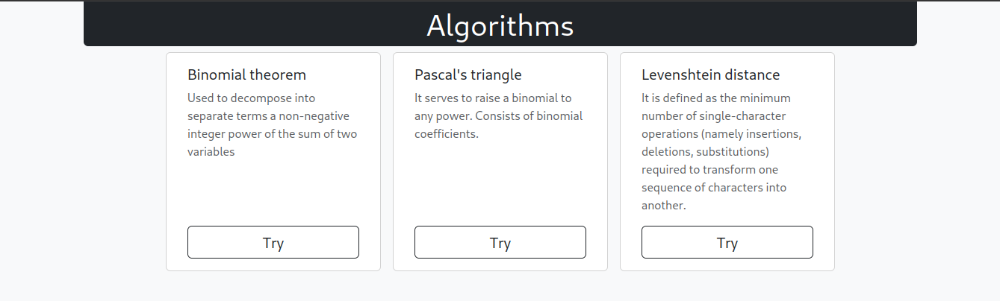
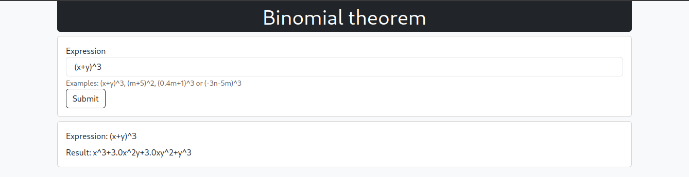
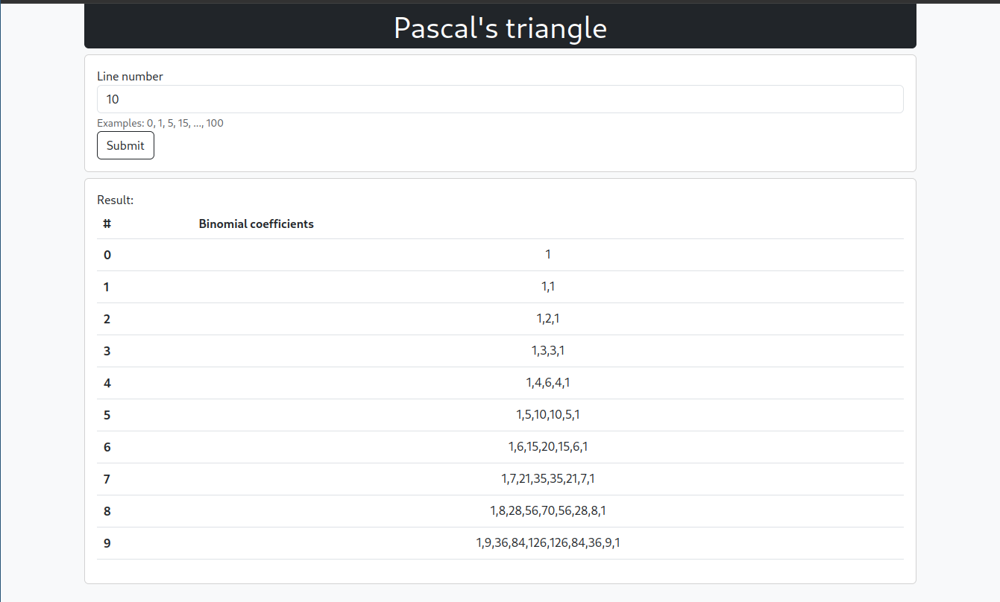
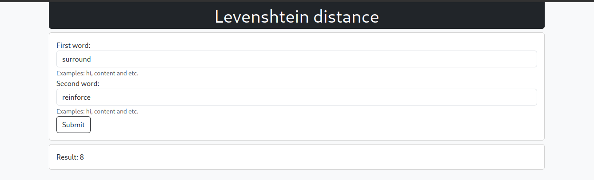

Algorithms_web
----

#### Run project

    python main.py
    docker-compose up -d # start on port: 5000

#### Description

Application written on Flask framework
There are 3 algorithms to which the application provides access through the web interface:

- Binomial theorem
- Pascal triangle
- Fuzzy search (Levenshtein distance)

#### API ['POST', 'application/json']:

    /api/binomial_theorem | {'expression': '(x+y)^2'} -> {'result': 'x^2+xy+y^2'}
    /api/pascal_triangle  | {'number': '3'} -> {'result': [[1], [1,1], [1,2,1]]}
    /api/fuzzy_search     | {'str_1': 'w1', 'str_2': 'w2'} -> {'result': 1}

The app doesn't reload the page to get the result because it uses JS.

